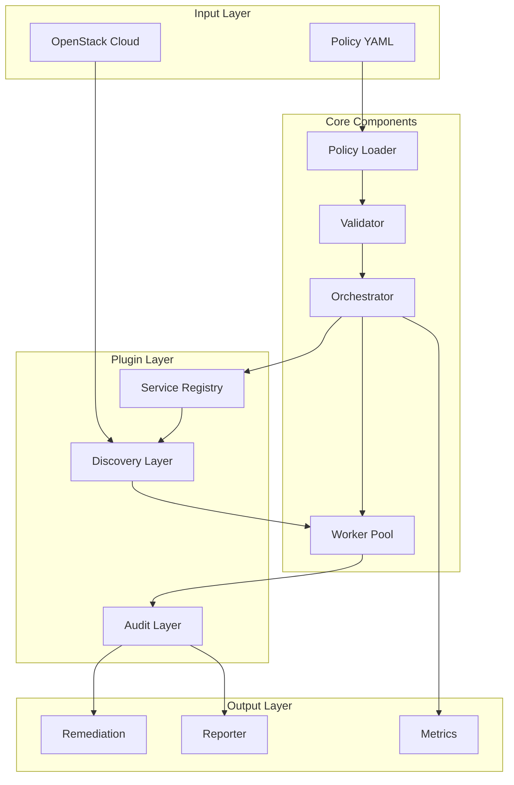
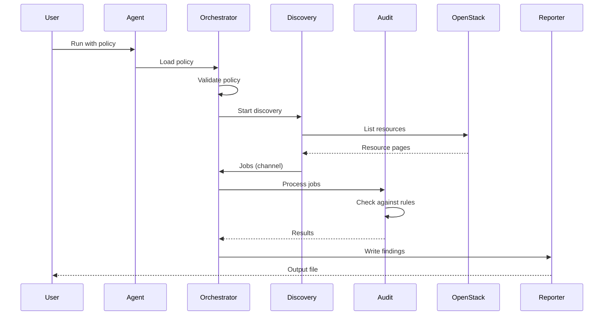
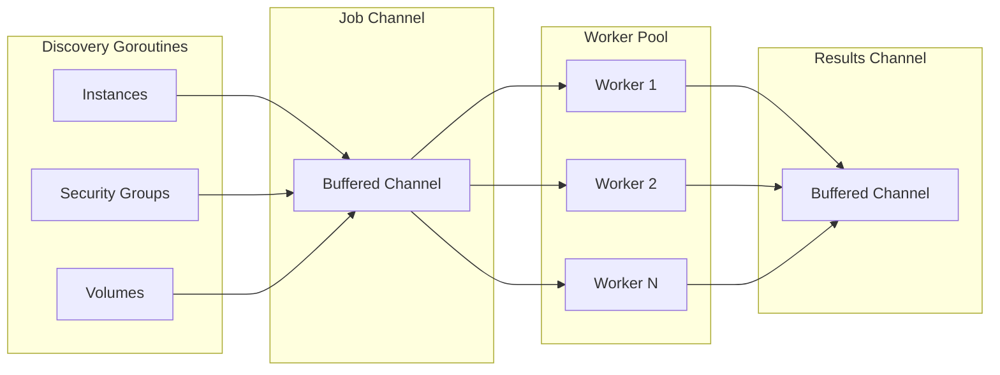

# Architecture

This document explains OSPA's architecture, components, and data flow.

## Overview

OSPA (OpenStack Policy Agent) follows a plugin-based architecture that makes it easy to add support for new OpenStack services and resource types.

## Architecture Diagram



## Components

### 1. Service Layer

**Location:** `pkg/services/`

Services are the top-level abstraction for OpenStack services (Nova, Neutron, Cinder, etc...). Each service:

- Manages authentication and client creation
- Provides access to resource auditors and discoverers
- Registers itself automatically via `init()` functions

**Key Files:**

| File | Description |
|------|-------------|
| `interface.go` | Service interface definition |
| `registry.go` | Service registration and lookup |
| `resource_registry.go` | Resource type registration |
| `services/*.go` | Service implementations |

**Example:**

```go
type NovaService struct{}

func (s *NovaService) Name() string { return "nova" }
func (s *NovaService) DisplayName() string { return "Compute" }

func init() {
    MustRegister(&NovaService{})
    RegisterResource("nova", "instance")
    RegisterResource("nova", "keypair")
}
```

### 2. Discovery Layer

**Location:** `pkg/discovery/`

Discoverers find resources in OpenStack. Each resource type has a discoverer that:

- Lists resources from the OpenStack API
- Converts them to generic `Job` structures
- Handles pagination and context cancellation

**Key Files:**

| File | Description |
|------|-------------|
| `interface.go` | Discoverer interface |
| `job.go` | Generic job structure |
| `services/*.go` | Service-specific discoverers |

**Job Structure:**

```go
type Job struct {
    Service      string      // "nova"
    ResourceType string      // "instance"
    ResourceID   string      // "abc123"
    ProjectID    string      // "project-1"
    Resource     interface{} // servers.Server
}
```

### 3. Audit Layer

**Location:** `pkg/audit/`

Auditors evaluate resources against policy rules. Each resource type has an auditor that:

- Implements `Check()` to evaluate compliance
- Implements `Fix()` to apply remediation
- Returns structured `Result` objects

**Key Files:**

| File | Description |
|------|-------------|
| `interface.go` | Auditor interface |
| `result.go` | Result structure |
| `<service>/<resource>.go` | Resource-specific auditors |

**Result Structure:**

```go
type Result struct {
    RuleID       string
    ResourceID   string
    ResourceName string
    ProjectID    string
    Status       string
    Compliant    bool
    Observation  string
    Rule         *policy.Rule
}
```

### 4. Policy Layer

**Location:** `pkg/policy/`

Policies define rules for auditing resources. The policy system:

- Loads YAML policy files
- Validates policy structure
- Provides rule evaluation context

**Key Files:**

| File | Description |
|------|-------------|
| `policy.go` | Policy structures |
| `loader.go` | YAML loading and parsing |
| `validator.go` | Main validation orchestrator |
| `validation/*.go` | Service-specific validators |

**Policy Structure:**

```yaml
version: v1
defaults:
  workers: 50
policies:
  - <service>:
    - name: rule-name
      service: <service>
      resource: <resource_type>
      check:
        # Conditions
      action: log|delete|tag
```

### 5. Orchestrator

**Location:** `pkg/orchestrator/`

The orchestrator coordinates the entire audit process:

- Loads and validates policies
- Manages worker pools
- Coordinates discovery, audit, and remediation
- Handles graceful shutdown

### 6. Remediation

**Location:** `pkg/remediate/`

The remediation system provides action handlers:

| Action | Description |
|--------|-------------|
| `log` | No-op, just logs violations |
| `delete` | Deletes resources |
| `tag` | Tags resources with metadata |

## Data Flow



## Concurrency Model

- **Discovery**: Each resource type has its own goroutine
- **Workers**: Configurable worker pool processes jobs
- **Results**: Buffered channel (100 items) for result aggregation
- **Shutdown**: Context-based cancellation with graceful shutdown



## Extension Points

### Adding a New Service

1. Create service implementation (`pkg/services/services/<service>.go`)
2. Add client method (`pkg/auth/auth.go`)
3. Create discoverers (`pkg/discovery/services/<service>.go`)
4. Create auditors (`pkg/audit/<service>/`)
5. Add validator (`pkg/policy/validation/<service>.go`)
6. Register in `init()` functions

### Adding a Resource to Existing Service

1. Create discoverer in `pkg/discovery/services/<service>.go`
2. Create auditor in `pkg/audit/<service>/<resource>.go`
3. Update service to return new discoverer/auditor
4. Register resource in service's `init()` function
5. Update validator if needed

## Best Practices

1. **Service Registration**: Always use `MustRegister()` in `init()`
2. **Resource Registration**: Register all resources in service's `init()`
3. **Error Handling**: Return errors, don't panic (except in `init()`)
4. **Context Handling**: Always respect context cancellation
5. **Type Safety**: Use type assertions with error checking
6. **Documentation**: Document supported resources in service comments

## Reference Implementations

For detailed examples, see existing service implementations:

| Service | Location |
|---------|----------|
| Nova | `pkg/services/services/nova.go`, `pkg/audit/nova/` |
| Neutron | `pkg/services/services/neutron.go`, `pkg/audit/neutron/` |
| Cinder | `pkg/services/services/cinder.go`, `pkg/audit/cinder/` |

