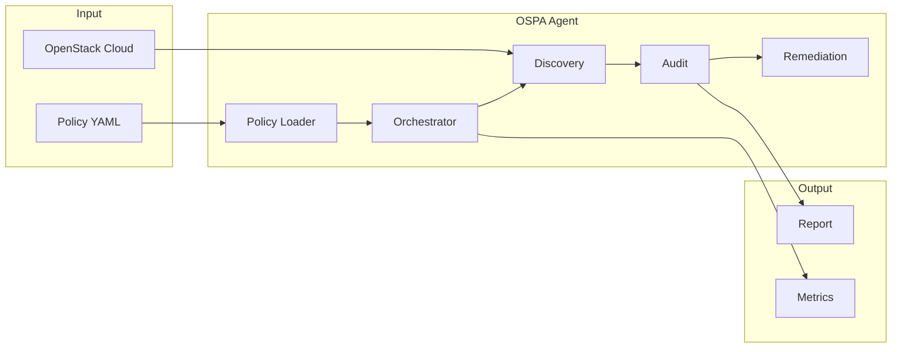

# OSPA - OpenStack Policy Agent

OSPA (OpenStack Policy Agent) is a flexible, policy-driven auditing and remediation tool for OpenStack environments. With OSPA, you can define rules in YAML, discover and evaluate OpenStack resources for compliance, and take automated actions if desired. 

OSPA leverages [gophercloud](https://github.com/gophercloud/gophercloud), the standard Go SDK for OpenStack, to interact with cloud APIs and manage resources safely and efficiently.


<div class="grid cards" markdown>

-  **Policy-Driven Auditing**

    ---

    Define audit rules in simple YAML policies. OSPA discovers resources and evaluates them against your rules.

    [→ Getting Started](getting-started/index.md)

- **Automatic Discovery**

    ---

    Concurrently enumerates OpenStack resources across services like Nova, Neutron, and Cinder.

    [→ User Guide](user-guide/index.md)

- **Safe Remediation**

    ---

    Optionally apply actions (log, delete, tag). Safe by default - nothing changes unless you explicitly enable fixes.

    [→ Writing Policies](user-guide/policies.md)

-  **Extensible**

    ---

    Add new OpenStack services and resources using the scaffold CLI tool with built-in validation.

    [→ Developer Guide](developer-guide/index.md)

</div>

## What is OSPA?

**OSPA (OpenStack Policy Agent)** is a policy-driven audit and remediation agent for OpenStack clouds. It helps you:

- **Define** audit rules in YAML policies
- **Discover** resources concurrently across OpenStack services
- **Audit** each discovered resource against your rules
- **Remediate** optionally with actions like log, delete, or tag

## Quick Example

Here's a simple policy that finds SSH ports open to the world:

```yaml
version: v1
defaults:
  workers: 50
policies:
  - neutron:
    - name: critical-ssh-open-to-world
      description: Find SSH rules open to 0.0.0.0/0
      resource: security_group_rule
      check:
        direction: ingress
        protocol: tcp
        port: 22
        remote_ip_prefix: 0.0.0.0/0
      action: log
```

Run the audit:

```bash
go run ./cmd/agent --cloud mycloud --policy policy.yaml --out findings.json
```

## Key Features

| Feature | Description |
|---------|-------------|
| **Multi-Service Support** | Nova, Neutron, Cinder, and more |
| **Concurrent Discovery** | Fast parallel resource enumeration |
| **Flexible Policies** | YAML-based with status, age, and custom checks |
| **Safe by Default** | Audit mode only; remediation requires `--fix` |
| **Extensible** | Add services via scaffold tool |
| **Multiple Output Formats** | JSON, CSV |
| **Prometheus Metrics** | Built-in metrics endpoint |

## Architecture Overview



## Getting Started

<div class="grid cards" markdown>

- **Installation**

    ---

    Clone, build, and set up OSPA in your environment.

    [→ Installation Guide](getting-started/installation.md)

- **Quick Start**

    ---

    Run your first audit in 5 minutes.

    [→ Quick Start](getting-started/quickstart.md)

</div>

## Community

- **GitHub**: [OpenStack-Policy-Agent/OSPA](https://github.com/OpenStack-Policy-Agent/OSPA)
- **Issues**: [Report bugs or request features](https://github.com/OpenStack-Policy-Agent/OSPA/issues)
- **Contributing**: [Contributor Guide](contributor-guide/index.md)

## License

OSPA is open source software licensed under the Apache 2.0 License.

